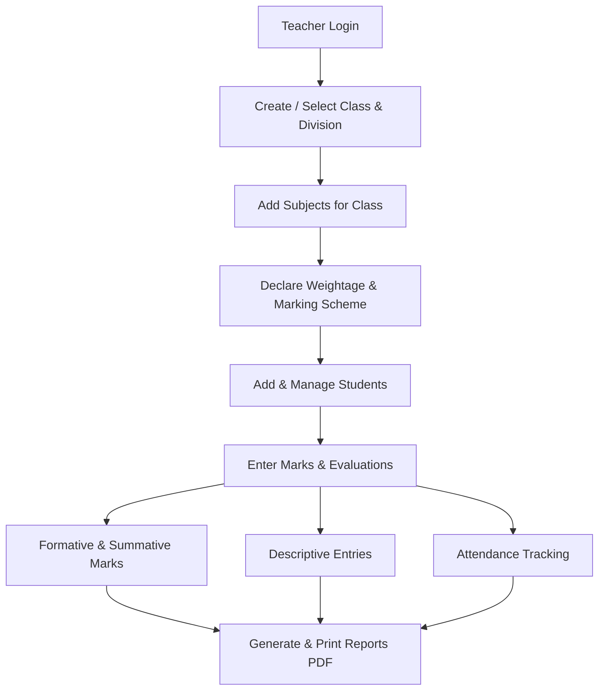

# MySchool

MySchool is a comprehensive Android application designed to help teachers efficiently manage school data, student records, academic evaluations, and report generation. The app provides a seamless and localized user experience (English and Marathi) with cloud synchronization using Firebase.

## Features & Pages

### 1. Dashboards & Home
- **Stats Dashboard (`StatsDashboardFragment`)**: View quick statistics of your classes, students, and overall progress.
- **Extra Dashboard (`ExtraDashboardFragment`)**: Additional summary views and quick actions for teachers.
- **Home Activity**: The main navigation hub to switch between different modules seamlessly.

### 2. School & Class Setup
- **Class & Division Management (`ClassDivListFragment`)**: Create and manage classes and divisions easily.
- **Subjects Setup (`SubjectsFragment`)**: Add subjects and toggle them for different classes.
- **Weightage Declaration (`DeclareWeightageFragment`)**: Define specific marking schemes, weightages, and structures for different subjects.

### 3. Student Management
- **Student List (`StudentListFragment`)**: Register new students, update profiles, and view a complete list of students per class/division. Includes quick access to student-specific actions.

### 4. Academic Evaluation & Grading
- **Formative & Summative Marks (`FormativeSummativeFragment`)**: A unified, dynamic grid/list interface to enter marks across various metrics (Oral, Practical, Project, Written, etc.) with automatic grade calculation.
- **Descriptive Entries (`DescriptiveEntriesFragment`)**: Specialized interface to enter descriptive remarks, strengths, and areas of improvement for students.
- **Attendance Tracking (`AttendanceFragment`)**: Easily record and manage daily or periodic attendance.

### 5. Report Generation & Output
- **Report Printing (`ReportPrintingFragment`, `ReportsFragment`)**: Generate comprehensive PDF marksheets and academic reports.
- **Print Settings (`InfoPrintSettingFragment`)**: Customize the school info, logos, and layouts for the generated reports.

### 6. Subscriptions & Teacher Profile
- **Profile Management (`ProfileFragment`)**: Update teacher details and manage personal info.
- **Subscription & History (`SubscriptionBottomSheet`, `SubscriptionHistoryActivity`)**: Manage app subscriptions, view past transactions, and handle premium features.
- **Settings (`SettingsFragment`)**: Manage app preferences, language switching (English/Marathi), and theme options.

### 7. Additional Tools
- **OCR Text Recognition**: Built-in support for scanning documents and extracting text using CameraX and Google ML Kit.
- **Extra Menus (`ExtraMenusFragment`)**: Access to additional utilities and help sections.

## Teacher Workflow

## Tech Stack
- **Language**: Java 17
- **UI Architecture**: Activities & Fragments, ViewBinding, Navigation Component
- **Backend & Database**: Firebase Authentication, Firestore, Storage
- **Libraries & Tools**: iText PDF, CameraX & ML Kit OCR, Glide

## Project Structure
- **`model/`**: Contains core data models (`Student`, `Teacher`, `ClassModel`, `MarksRecord`, `Subject`, etc.).
- **`repository/`**: Handles data operations (`FirebaseRepository`).
- **`ui/`**: Fragments and Activities organized by feature (Dashboards, Evaluation, Reports).
- **`adapter/`**: RecyclerView adapters for dynamic list rendering.
- **`utils/`**: Helper classes, formatting, animations, and session management (`SessionContext`, `AppCache`).

## Running the Project
1. Clone the repository and open it in Android Studio.
2. Ensure you have the `google-services.json` file added to the `app/` directory.
3. Sync the project with Gradle files.
4. Build and run the app on an Android device or emulator running API 24 or higher (Target API 35).
