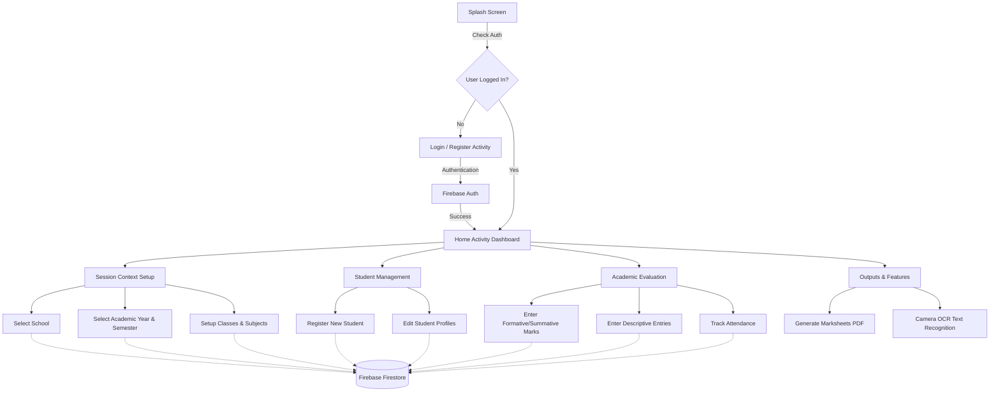

# MySchool

MySchool is a comprehensive Android application designed to help teachers efficiently manage school data, student records, academic evaluations, and report generation. The app provides a seamless and localized user experience (English and Marathi) with cloud synchronization using Firebase.

## Features & Workflows

### 1. Authentication & Teacher Profile
- **Firebase Auth**: Secure login and registration for teachers.
- **Session Management**: Tracks the active session context (Academic Year, Semester, School, and Class).

### 2. School & Class Setup
- **School Management**: Register and manage school information, including UDISE codes and boards.
- **Class & Subject Organization**: Create classes and assign subjects with detailed marking schemes (Max Marks, Oral, Written, Practical, Projects, etc.).
- **Academic Year & Semester Tracking**: Define current academic years and semesters to organize data contextually.

### 3. Student Management
- **Student Profiles**: Register new students, update their profiles, and capture detailed demographic and academic information.
- **Class Rosters**: Easily view and manage lists of students across different classes and divisions.

### 4. Academic Evaluation & Grading
- **Marks Entry**: Enter formative and summative marks for various evaluation categories.
- **Descriptive Entries**: Add descriptive evaluations and remarks for students.
- **Attendance Tracking**: Manage and review student attendance.

### 5. Report Generation & OCR
- **PDF Reports**: Automatically generate comprehensive marksheets and academic reports using the iText PDF library.
- **OCR Integration**: Built-in support for scanning documents and extracting text using CameraX and Google ML Kit.

### 6. Localization
- Fully supports bilingual switching between **English** and **Marathi** within the app dynamically.

## Application Workflow Architecture

## Tech Stack
- **Language**: Java 17
- **UI Architecture**: Activities & Fragments, ViewBinding, Navigation Component
- **Backend & Database**: 
  - Firebase Authentication
  - Firebase Firestore (Cloud Database)
  - Firebase Storage
  - Room Database (Local Caching)
- **Libraries & Tools**: 
  - **iText PDF**: For report and document generation.
  - **CameraX & ML Kit OCR**: For document scanning and text recognition.
  - **Glide**: For image loading and caching.
  - **OkHttp**: For network requests.

## Project Structure
The app's source code is primarily contained in `app/src/main/java/com/example/myschool/` and follows a structured approach:
- **`model/`**: Contains core data models (`Student`, `Teacher`, `ClassModel`, `MarksRecord`, `Subject`, etc.).
- **`repository/`**: Handles data operations (`FirebaseRepository` for Firestore interactions).
- **`ui/` & Root Activities**: UI components, Fragments, and main activities like `HomeActivity`, `EnterMarksActivity`, etc.
- **`adapter/`**: RecyclerView adapters for list rendering.
- **`utils/`**: Helper classes, animations, and session management (`SessionContext`, `AppCache`).

## Running the Project
1. Clone the repository and open it in Android Studio.
2. Ensure you have the `google-services.json` file added to the `app/` directory for Firebase services to function properly.
3. Sync the project with Gradle files.
4. Build and run the app on an Android device or emulator running API 24 or higher (Target API 35).
